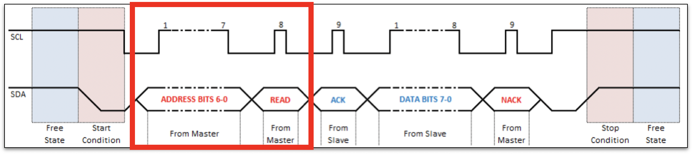
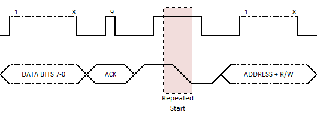

# Part 2 - Exploring I2C with the REPL

Now that we are a bit more familiar with the micro:bit and the REPL let's
explore the I2C interface.


## Documentation You'll Need

- https://microbit-micropython.readthedocs.io/en/v1.0.1/i2c.html
- MMA8653FC datasheet, section 5.8 "Serial I2C Interface"


## Scanning I2C Devices

First, let's check what we have available in the I2C class:

```
>>> from microbit import i2c
>>> dir(i2c)
```

Let's run the scan method:
https://microbit-micropython.readthedocs.io/en/latest/i2c.html#microbit.i2c.scan

```
>>> from microbit import i2c
>>> i2c.scan()
```

- What results are you getting? And how many?
- Make a note of these addresses as we will use them soon


## I2C Address Formats

When the master device initialises a transaction, the first byte sent down the
wire will contain the 7-bit address of the slave devices followed by a bit to
indicate if this is a Read (1) or Write (0) operation.



While the slave addresses are 7-bit, sometimes the documentation might refer to
the "full address" as two an 8-bit addresses, one for reading and one for
writing.

For example, a slave with 7-bit address `0x05` (`0b0000101`) could also be
referred to have addresses `0xA` and `0xB` (`0b0001010` and `0b0001011`).

For this workshop we will always refer to the 7-bit address, as that's the
format used by all the methods in the MicroPython I2C class.


## MMA8653FC I2C Address

The BBC micro:bit has two I2C devices on board, one is the MAG3110 magnetometer,
the other is the MMA8653FC accelerometer.

For this workshop we will write a Python driver for the MMA8653FC accelerometer.

The I2C address of the accelerometer can be found in its datasheet, in one of
the tables from section 5.8 "Serial I2C Interface".

- Does the number listed in the datasheet match one of the values returned by
`i2c.scan()`?
- The datasheet might show the address in hexadecimal format, can you convert
  the numbers returned by `i2c.scan()` into hexadecimal?
    - You can use this online converter:
      https://www.binaryhexconverter.com/decimal-to-hex-converter


## Talking With The Accelerometer

Okay, so let's try to read something from the accelerometer!

The first thing we need to do is find a good register to read from, one
with a constant value would be a great candidate.

Search for a register named "WHO AM I" in the datasheet. This is a very common
common register to have in electronic devices, and it is normally used to store
a constant value to identify the part.

Doing an I2C read operation is a two-part process:
1. First send a write operation (`i2c.write()`) to the correct slave address
  with the register address we want to read
    - https://microbit-micropython.readthedocs.io/en/v1.0.1/i2c.html#microbit.i2c.write
    - A buffer can be a Bytes object and you can be created like this:
      `bytes([LIST_OF_VALUES])`
2. Then send a read operation (`i2c.read()`) to the same slave address with the
  number of bytes you want to read
    - https://microbit-micropython.readthedocs.io/en/v1.0.1/i2c.html#microbit.i2c.read
    - Most devices will let you read multiple registers continuously with a
      single read operation, but let's start with reading just a single register

```
>>> i2c.write(???)
>>> result = i2c.read(???)
```

- Did you get what you were expecting? If you didn't check the troubleshooting
  section bellow

Then you can compare the data read into `result` against the value indicated in
the datasheet.

```
>>> from microbit import i2c, display, Image
>>> i2c.write(???)
>>> read_data = i2c.read(???)
>>> if read_data[0] == 0x5A:
>>>     display.show(Image.HAPPY)
```


## Troubleshooting

### Did it work? Are you reading value `0xFF`?

This is because this device requires the read operation to be sent immediately
after the write operation without interruption (i.e. without sending a stop
bit, and instead sending a repeat start bit).



- Can you find a way in the I2C documentation to do a repeat start bit before
  the read operation?

### Are you getting a letter?

What's the hex value of that letter?

You can use the REPL or an online tool like this one to check your value:
https://www.rapidtables.com/convert/number/ascii-to-hex.html
